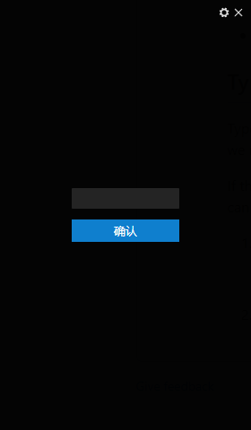
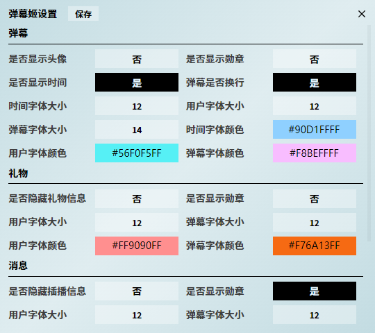

<br />
<p align="center">
  <a href="https://github.com/pure-dust/barrageforbilibili" target="blank">
    
  </a>
  <h2 align="center" style="font-weight: 600">Barrage For Bilibili</h2>
</p>

## 简介
- 本项目是个人兴趣使然所开发的一个bilibili直播弹幕姬  
- 使用tauri框架进行开发
- 目前功能简单，更多复杂功能将在后续版本中更新
- 如有需求或者bug请提出一个 [issue](https://github.com/pure-dust/barrageforbilibili/issues) 来描述所需要的功能或者遇到的问题  


## 安装

访问 [Releases](https://github.com/pure-dust/barrageforbilibili/releases)页面下载安装包。  
~~目前只支持 windows(10/11)平台~~  
windows: win10/win11  
macos: 使用github action打包，请自行下载验证  
linux: 使用github action打包，请自行下载验证

## 打包客户端

```shell
# 打包命令
npm run tauri build
# or
yarn tauri build
```

## 开发环境配置

需要自行安装 [Nodejs](https://nodejs.org/) 与 [Rust](https://www.rust-lang.org/zh-CN/tools/install) 环境

运行本项目（假设已经配置完成正确的开发环境）

```shell
# 安装node依赖
yarn
# or
npm install

# 运行
yarn tauri dev
# or
npm run tauri dev
# 在运行之前，cargo会自动下载所需要的依赖
```

## 开源许可
基于 [MIT license](https://opensource.org/licenses/MIT) 许可进行开源。

## 软件截图

<p align="center">
    
</p>

<p align="center">
    
</p>

<p align="center">
    
</p>
